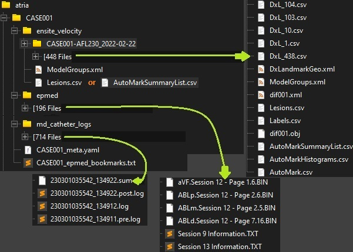
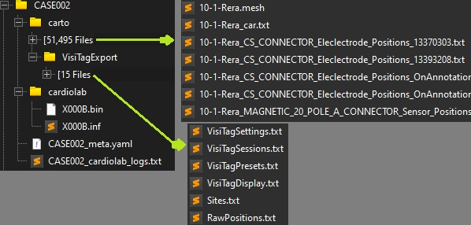

# EP-parse

A collection of programs built to assist in exporting, cleaning, and formatting data from several EP signal and/or mapping systems.  The input is a chaotic set of mostly text, binary, and mesh files with lots of overlaps and inconsistency. The output is a tabular dataset of timeseries data (e.g. for ECG channels), a CSV of bookmarks, a standardized heart geometry VTK file, and a JSON file with event's / tags localized to the patient's heart geometry and timestamps corresponding to the EP system (vs the mapping system).

- [EP-parse](#ep-parse)
- [Project setup](#project-setup)
  - [Setting up Python and your virtual environment](#setting-up-python-and-your-virtual-environment)
  - [Environment variables](#environment-variables)
  - [Logging](#logging)
    - [Developer Settings](#developer-settings)
    - [Analyst Settings](#analyst-settings)
- [Quick Start Guide](#quick-start-guide)
- [Importing Case Data](#importing-case-data)
  - [EPmed (EP system)](#epmed-ep-system)
  - [Ensite Velocity (Mapping system)](#ensite-velocity-mapping-system)
  - [Cardiolab (EP system)](#cardiolab-ep-system)
  - [Carto (Mapping system)](#carto-mapping-system)
- [Troubleshooting and Tips](#troubleshooting-and-tips)
  - [No module named \<...\>](#no-module-named-)
  - [Activate a virtual environment](#activate-a-virtual-environment)
  - [Jupyter Notebooks](#jupyter-notebooks)

   
# Project setup
## Setting up Python and your virtual environment
Install or update Python to version 3.10 or higher.  Running `python --version` or `python3 --version` in a terminal should tell you the version.
The first time that you setup your project, you will need to create a virtual environment in the project root directory and install the project dependencies within it.  The steps for this are:
- Navigate to the project's root directory, hereafter refered to as `project_root`
  - i.e. the top level of your cloned repo, where this README file lives
- Run `python3 -m venv .venv` to create the virtual environment
- [Activate your virtual environment](#activate-a-virtual-environment)
- Run `pip install -r requirements.txt` to install project dependencies
## Environment variables
Create a file named `.env` in the `project_root` directory.  Edit that file and specify the path to the directory where you would like to store your data as the `data_filepath`, e.g.
`data_filepath="D:\\ep_exports"`

## Logging
Logger configurations are set in the `logs` directory.
### Developer Settings
When environment variable `DEV_MODE` exists with a non-empty value, the system will use the `logs/dev_logging_configs.yaml` setup.  This will simply stream any log statements >= DEBUG to your std output, such that you will see them in your notebook.
### Analyst Settings
Log statements <= INFO level will be written to the `logs/app.log` file.

# Quick Start Guide
1. Open a terminal, navigate to the `project_root` directory and [activate your virtual environment](#activate-a-virtual-environment)
2. Run the jupyter notebook web UI, `jupyter notebook`, and select the `EP_parse.ipynb` notebook

# Importing Case Data
1. For a new case (e.g. `CASE000` for this example), create a new folder in your `data_filepath` folder with the case name as the filename (e.g. `CASE000`).
2. Export signal data from the research center's epsystem
3. Export the epsystem logs/bookmark files and store it at the top level of the case export folder
   1. Typical workflow for this:
      1. Digitize the logs by either:
         1. Printing the pages to pdf
         2. Taking screenshots (via the EP system or your phone)
      2. Convert the pdf or images into a text file (e.g. upload to GDrive, Open With -> Google Doc, then open that Google Doc file and export/download as text/txt file)
         1. If individual images were converted to text documents, concatenate the content of the text files into a single text file (maintain page order)

## EPmed (EP system)

1. Name your logs/bookmark text file `<CASEID>_epmed_bookmarks.txt` and put it at the top level of the case's directory
2. If an MD catheter was used such that the epsystem logs do not contain RF data, put the MD catheter logs into the case data directory (see `md_catheter_logs` folder in image) and then use the associated cell in jupyter notebook to generate a standardized bookmark file from that data

## Ensite Velocity (Mapping system)
1. Export any Ensite data into a `ensite_velocity` folder within your case data directory
2. The name of `ensite_velocity` subdirectories, e.g. `CASE001-AFL230_2022_02_22`, are important!  The format is `<CASE_ID>-<MapName>_<Date>` and the MapName should NOT include a `_` character (use `-` instead).
3. The `ModelGroups.xml` file should be pulled from one of the Map directories and placed at the top level
4. Inspect the `AutoMarkSummaryList.csv` file from one of the Map directories.  If it contains information for the RFs (esp. times), move that file to the top level (see image).
   1. If the `AutoMarkSummaryList.csv` does NOT contain RF information, the user is expected to manually add RF times to one of the `Lesions.csv` files.  The workflow for this is:
      1. Move a `Lesions.csv` file from one of the Map directories to the top ensite level (see image)
      2. Open that file and add a new `Time` column in the table section of it
      3. Use the Ensite system to lookup times for tags of interest (e.g. Red or Orange ones), enter those times in the `Time` column, and save the final result.
         1. Note that a time can/should be added for only the rows of interest, and left blank otherwise.

## Cardiolab (EP system)

1. Name your logs text file `<CASEID>_cardiolab_logs.txt` and put it at the top level of the case's directory

## Carto (Mapping system)
1. Export the Carto data (if applicable), rename the exported folder `carto`, and place it in the case directory

# Troubleshooting and Tips
## No module named <...>
Ensure that your virtual environment is running and that you have installed dependencies in it via `pip install -r requirements.txt`

## Activate a virtual environment
You can activate your virtual environment by navigating to the `project_root` directory and running:
- `source .venv/bin/activate` on Mac/Linux
- `.venv/Scripts/activate.ps1` on Windows

## Jupyter Notebooks
1. Open a terminal, navigate to the `project_root` directory, and activate your virtual environment
2. Run the jupyter notebook web UI, `jupyter notebook`, and select your notebook